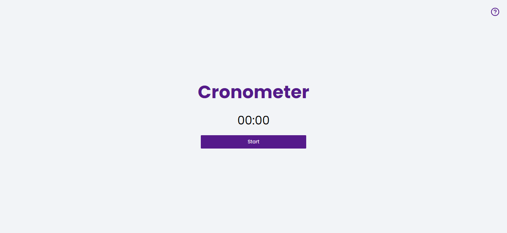
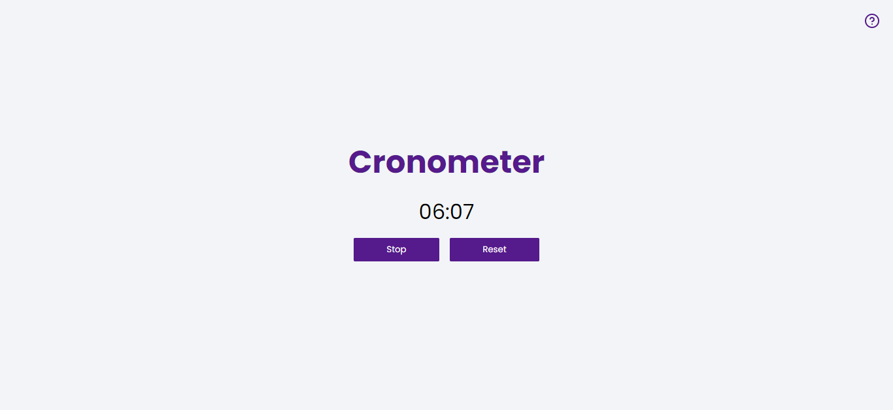

# Vanilla JavaScript Cronometer⏰
***

## About the project💻 
This is a project I´ve made to practice my JS and logic skills. It focuses on manipulating DOM elements and working with functions.
Hope to improve anything when I find it possible!

[- Visit host!]()

## Screenshots📷

## Insights💡
- [X] Using data attributes in HTML
- [X] Showing and hidding elements with CSS and JavaScript
- [X] Using setInterval and clearInterval functions
- [X] Creating a function to place a zero beside number under 10
- [X] Using querySelectorAll functions 
- [X] Working with paramethized functions
- [X] Using element´s dataset object attribute
- [X] Using closest function

